# Execution Plan - Household Spending Tracker

## Project Overview
- **Project Type**: Greenfield (New Application)
- **Project Name**: Household Spending Tracker
- **Start Date**: 2026-02-23
- **Current Phase**: INCEPTION - Workflow Planning

---

## Detailed Analysis Summary

### Change Impact Assessment

#### User-facing Changes
**YES** - Complete new user interface
- Web-based application with multiple views (import, review, reporting, category management)
- CSV upload interface with drag-and-drop
- Transaction review and classification interface
- Monthly spending reports
- Category management interface
- 4 distinct user personas with different usage patterns

#### Structural Changes
**YES** - New system architecture from scratch
- Multi-tier architecture: Frontend (React/Vue) + Backend (Node.js/TypeScript) + Database (SQLite)
- CSV parsing and validation layer
- ML classification engine
- Transaction management system
- Reporting engine
- Category management system

#### Data Model Changes
**YES** - Complete new data model
- Transactions table (14 CSV columns + classification metadata)
- Categories table (user-defined spending categories)
- Classification history table (ML training data)
- ML model state persistence
- Relationships: Transactions → Categories (many-to-one)

#### API Changes
**YES** - New API endpoints required
- CSV upload and parsing endpoints
- Transaction CRUD operations
- Classification endpoints (ML suggestions, manual classification)
- Category CRUD operations
- Reporting endpoints (monthly summaries, transaction lists)
- ML model training and prediction endpoints

#### NFR Impact
**YES** - Multiple non-functional requirements
- **Performance**: CSV processing (1000 transactions in <5s), ML classification (<2s per transaction), report generation (<3s)
- **Security**: Local data storage, no external transmission, secure handling of financial data
- **Scalability**: Support up to 10,000 transactions efficiently
- **Usability**: Intuitive interface, minimal training required, responsive design
- **Maintainability**: TypeScript best practices, modular architecture, well-documented code

### Risk Assessment
- **Risk Level**: **MEDIUM**
- **Rationale**: 
  - Greenfield project with clear requirements reduces unknowns
  - ML implementation adds complexity but scope is well-defined
  - Local-only application simplifies deployment and security
  - Multiple integrated components require careful coordination
  - Technology stack is mature and well-supported
- **Rollback Complexity**: N/A (greenfield project)
- **Testing Complexity**: **MODERATE**
  - Unit testing for individual components
  - Integration testing for CSV parsing → ML → Database flow
  - ML accuracy testing requires test data sets
  - UI testing for multiple user workflows

### Component Complexity Analysis

#### High Complexity Components
1. **ML Classification Engine**
   - Text feature extraction from transaction descriptions
   - Pattern learning from historical classifications
   - Confidence scoring algorithm
   - Incremental model training
   - Handling new/unseen merchants

2. **CSV Parser and Validator**
   - 14-column custom format parsing
   - Format validation and error handling
   - Duplicate detection logic
   - Data transformation and normalization

#### Medium Complexity Components
3. **Transaction Management System**
   - CRUD operations with classification state
   - Duplicate detection and prevention
   - Bulk operations for reclassification
   - Transaction history tracking

4. **Reporting Engine**
   - Monthly aggregation by category
   - Income vs expense separation
   - Date range filtering
   - Transaction drill-down

#### Lower Complexity Components
5. **Category Management**
   - Simple CRUD operations
   - Validation (unique names, prevent deletion with transactions)
   - Transaction count tracking

6. **Web UI**
   - Standard React/Vue components
   - Form handling and validation
   - Responsive layout

---

## Workflow Visualization

```mermaid
flowchart TD
    Start(["User Request:<br/>Household Spending Tracker"])
    
    subgraph INCEPTION["🔵 INCEPTION PHASE"]
        WD["Workspace Detection<br/><b>COMPLETED</b>"]
        RA["Requirements Analysis<br/><b>COMPLETED</b>"]
        US["User Stories<br/><b>COMPLETED</b>"]
        WP["Workflow Planning<br/><b>IN PROGRESS</b>"]
        AD["Application Design<br/><b>EXECUTE</b>"]
        UP["Units Planning<br/><b>EXECUTE</b>"]
        UG["Units Generation<br/><b>EXECUTE</b>"]
    end
    
    subgraph CONSTRUCTION["🟢 CONSTRUCTION PHASE"]
        FD["Functional Design<br/><b>EXECUTE</b>"]
        NFRA["NFR Requirements<br/><b>EXECUTE</b>"]
        NFRD["NFR Design<br/><b>EXECUTE</b>"]
        ID["Infrastructure Design<br/><b>EXECUTE</b>"]
        CP["Code Planning<br/><b>EXECUTE</b>"]
        CG["Code Generation<br/><b>EXECUTE</b>"]
        BT["Build and Test<br/><b>EXECUTE</b>"]
    end
    
    subgraph OPERATIONS["🟡 OPERATIONS PHASE"]
        OPS["Operations<br/><b>PLACEHOLDER</b>"]
    end
    
    Start --> WD
    WD --> RA
    RA --> US
    US --> WP
    WP --> AD
    AD --> UP
    UP --> UG
    UG --> FD
    FD --> NFRA
    NFRA --> NFRD
    NFRD --> ID
    ID --> CP
    CP --> CG
    CG --> BT
    BT --> End(["Complete"])
    
    style WD fill:#4CAF50,stroke:#1B5E20,stroke-width:3px,color:#fff
    style RA fill:#4CAF50,stroke:#1B5E20,stroke-width:3px,color:#fff
    style US fill:#4CAF50,stroke:#1B5E20,stroke-width:3px,color:#fff
    style WP fill:#FFA726,stroke:#E65100,stroke-width:3px,color:#000
    style AD fill:#FFA726,stroke:#E65100,stroke-width:3px,stroke-dasharray: 5 5,color:#000
    style UP fill:#FFA726,stroke:#E65100,stroke-width:3px,stroke-dasharray: 5 5,color:#000
    style UG fill:#FFA726,stroke:#E65100,stroke-width:3px,stroke-dasharray: 5 5,color:#000
    style FD fill:#FFA726,stroke:#E65100,stroke-width:3px,stroke-dasharray: 5 5,color:#000
    style NFRA fill:#FFA726,stroke:#E65100,stroke-width:3px,stroke-dasharray: 5 5,color:#000
    style NFRD fill:#FFA726,stroke:#E65100,stroke-width:3px,stroke-dasharray: 5 5,color:#000
    style ID fill:#FFA726,stroke:#E65100,stroke-width:3px,stroke-dasharray: 5 5,color:#000
    style CP fill:#FFA726,stroke:#E65100,stroke-width:3px,stroke-dasharray: 5 5,color:#000
    style CG fill:#FFA726,stroke:#E65100,stroke-width:3px,stroke-dasharray: 5 5,color:#000
    style BT fill:#FFA726,stroke:#E65100,stroke-width:3px,stroke-dasharray: 5 5,color:#000
    style OPS fill:#BDBDBD,stroke:#424242,stroke-width:2px,stroke-dasharray: 5 5,color:#000
    style Start fill:#CE93D8,stroke:#6A1B9A,stroke-width:3px,color:#000
    style End fill:#CE93D8,stroke:#6A1B9A,stroke-width:3px,color:#000
    style INCEPTION fill:#BBDEFB,stroke:#1976D2,stroke-width:2px
    style CONSTRUCTION fill:#C8E6C9,stroke:#388E3C,stroke-width:2px
    style OPERATIONS fill:#FFF59D,stroke:#F57F17,stroke-width:2px
    
    linkStyle default stroke:#333,stroke-width:2px
```

---

## Phases to Execute

### 🔵 INCEPTION PHASE

#### ✅ Completed Phases
- [x] **Workspace Detection** - COMPLETED
  - Confirmed greenfield project
  - No existing codebase to analyze
  
- [x] **Requirements Analysis** - COMPLETED
  - 8 functional requirement categories (FR1-FR8)
  - 8 non-functional requirement categories (NFR1-NFR8)
  - 5 detailed user scenarios
  - Technology stack defined
  
- [x] **User Stories** - COMPLETED
  - 23 user stories across 7 workflow categories
  - 4 user personas defined
  - 12 MVP stories, 7 Post-MVP stories, 4 Future stories
  - INVEST principles validated

- [x] **Workflow Planning** - IN PROGRESS
  - This document

#### 📋 Phases to Execute

- [ ] **Application Design** - **EXECUTE**
  - **Rationale**: Greenfield project requires complete system architecture design
  - **Deliverables**:
    - System architecture diagram (frontend, backend, database, ML engine)
    - Component identification and responsibilities
    - Service layer design
    - Component interaction patterns
    - Technology stack confirmation
  - **Why Execute**:
    - Multiple new components needed (CSV parser, ML engine, transaction manager, reporting, UI)
    - Component boundaries and responsibilities must be clearly defined
    - Service layer design required for API endpoints
    - Integration patterns between components need specification
    - Foundation for all subsequent design and implementation phases

- [ ] **Units Planning** - **EXECUTE**
  - **Rationale**: Complex data models, APIs, and business logic require detailed unit planning
  - **Deliverables**:
    - Data model design (Transactions, Categories, Classification History, ML Model State)
    - Database schema with relationships and constraints
    - API endpoint specifications (request/response formats)
    - ML algorithm design (feature extraction, classification, confidence scoring)
    - Business logic specifications (duplicate detection, auto-approval thresholds)
  - **Why Execute**:
    - New data models with complex relationships
    - Multiple API endpoints for different workflows
    - ML classification algorithm requires detailed design
    - Business rules need clear specification (confidence thresholds, duplicate detection)
    - State management for classification workflow

- [ ] **Units Generation** - **EXECUTE**
  - **Rationale**: Generate concrete unit specifications from planning phase
  - **Deliverables**:
    - Database schema SQL/migration files
    - API endpoint specifications (OpenAPI/Swagger format)
    - Data model TypeScript interfaces
    - ML model structure and parameters
    - Configuration specifications
  - **Why Execute**:
    - Provides concrete specifications for implementation
    - Ensures consistency across components
    - Enables parallel development of frontend and backend
    - Documents API contracts for testing

---

### 🟢 CONSTRUCTION PHASE

- [ ] **Functional Design** - **EXECUTE**
  - **Rationale**: Complex business logic and component methods require detailed functional design
  - **Deliverables**:
    - Component method signatures and specifications
    - Business logic algorithms (CSV parsing, duplicate detection, ML classification)
    - Data transformation logic
    - Error handling strategies
    - Validation rules
  - **Why Execute**:
    - CSV parsing logic with 14-column format validation
    - ML classification algorithm with confidence scoring
    - Duplicate detection logic (multi-field matching)
    - Auto-approval threshold logic
    - Transaction state management (unclassified → classified → approved)
    - Category validation rules (unique names, prevent deletion with transactions)

- [ ] **NFR Requirements** - **EXECUTE**
  - **Rationale**: Multiple critical non-functional requirements need detailed specification
  - **Deliverables**:
    - Performance requirements with specific metrics
    - Security requirements for financial data
    - Scalability requirements and limits
    - Usability requirements and guidelines
    - Maintainability standards
  - **Why Execute**:
    - Performance targets specified (CSV: <5s, ML: <2s, Reports: <3s)
    - Security critical for financial data (local storage, no external transmission)
    - Scalability requirements (10,000 transactions)
    - Usability requirements for 4 different personas
    - Maintainability standards for TypeScript codebase

- [ ] **NFR Design** - **EXECUTE**
  - **Rationale**: NFR requirements need concrete implementation strategies
  - **Deliverables**:
    - Performance optimization strategies (batch processing, indexing)
    - Security implementation approach (data encryption, secure storage)
    - Scalability design patterns (pagination, lazy loading)
    - Usability design guidelines (responsive design, error messages)
    - Code quality standards and tooling (ESLint, Prettier, TypeScript strict mode)
  - **Why Execute**:
    - CSV batch processing for performance
    - Database indexing strategy for query performance
    - ML model optimization for classification speed
    - Secure local storage implementation
    - Responsive UI design for multiple devices
    - Code quality tooling setup

- [ ] **Infrastructure Design** - **EXECUTE**
  - **Rationale**: Local web server, database setup, and ML model storage require infrastructure design
  - **Deliverables**:
    - Local web server configuration (Express.js)
    - SQLite database setup and location
    - ML model storage and persistence strategy
    - File upload handling (CSV files)
    - Static file serving (frontend assets)
    - Development vs production configuration
  - **Why Execute**:
    - Local web server needed for frontend and API
    - SQLite database file location and initialization
    - ML model persistence between sessions
    - CSV file upload and temporary storage
    - Frontend build and serving strategy
    - Environment configuration (development, production)

- [ ] **Code Planning** - **EXECUTE** (ALWAYS)
  - **Rationale**: Implementation approach and file structure needed
  - **Deliverables**:
    - Project structure and file organization
    - Module dependencies and import strategy
    - Implementation order and priorities
    - Testing strategy (unit, integration, E2E)
    - Build and deployment approach
  - **Why Execute**:
    - Always executed per AI-DLC methodology
    - Provides roadmap for code generation phase
    - Defines implementation priorities (MVP first)
    - Establishes testing approach

- [ ] **Code Generation** - **EXECUTE** (ALWAYS)
  - **Rationale**: Implement the application
  - **Deliverables**:
    - Complete application codebase
    - Backend services (Node.js/TypeScript)
    - Frontend application (React/Vue)
    - Database schema and migrations
    - ML classification engine
    - Configuration files
    - Documentation
  - **Why Execute**:
    - Always executed per AI-DLC methodology
    - Implements all designed components
    - Creates working application

- [ ] **Build and Test** - **EXECUTE** (ALWAYS)
  - **Rationale**: Verify implementation and ensure quality
  - **Deliverables**:
    - Build configuration and scripts
    - Unit tests for all components
    - Integration tests for workflows
    - ML accuracy tests
    - Test data sets
    - Build and test reports
  - **Why Execute**:
    - Always executed per AI-DLC methodology
    - Validates implementation against requirements
    - Ensures code quality and reliability
    - Verifies ML classification accuracy

---

### 🟡 OPERATIONS PHASE

- [ ] **Operations** - **PLACEHOLDER**
  - **Rationale**: Future deployment and monitoring workflows
  - **Note**: Not applicable for local-only application in current scope

---

## Execution Summary

### Phases to Execute: 11 phases

#### INCEPTION (4 phases)
1. Application Design
2. Units Planning
3. Units Generation
4. (Workflow Planning - current)

#### CONSTRUCTION (7 phases)
5. Functional Design
6. NFR Requirements
7. NFR Design
8. Infrastructure Design
9. Code Planning
10. Code Generation
11. Build and Test

### Phases Skipped: 0 phases

**All conditional phases will be executed** due to:
- Greenfield project requiring complete system design
- Multiple new components and services
- Complex data models and APIs
- ML classification engine requiring detailed design
- Significant NFR requirements (performance, security, scalability)
- Local infrastructure setup needed

---

## Estimated Timeline

### Phase Duration Estimates
- **Application Design**: 2-3 hours
- **Units Planning**: 3-4 hours
- **Units Generation**: 2-3 hours
- **Functional Design**: 4-5 hours
- **NFR Requirements**: 2-3 hours
- **NFR Design**: 3-4 hours
- **Infrastructure Design**: 2-3 hours
- **Code Planning**: 2-3 hours
- **Code Generation**: 8-12 hours
- **Build and Test**: 4-6 hours

### Total Estimated Duration
**32-46 hours** of AI-assisted development time

**Note**: Actual duration may vary based on:
- Complexity discovered during implementation
- ML model training and tuning requirements
- Testing and debugging needs
- User feedback and iteration

---

## Success Criteria

### Primary Goal
Create a functional household spending tracker that imports bank CSV files, classifies transactions using ML, and generates monthly spending reports.

### Key Deliverables
1. ✅ Working web application (frontend + backend)
2. ✅ CSV import with 14-column format support
3. ✅ ML classification engine with confidence scoring
4. ✅ Transaction review and approval workflow
5. ✅ Category management system
6. ✅ Monthly spending reports
7. ✅ SQLite database with proper schema
8. ✅ Complete test suite
9. ✅ Documentation (setup, usage, architecture)

### Quality Gates
1. **Functional Completeness**: All 12 MVP user stories implemented
2. **Performance**: Meets specified performance targets (CSV <5s, ML <2s, Reports <3s)
3. **Code Quality**: TypeScript strict mode, ESLint passing, well-documented
4. **Test Coverage**: >80% code coverage, all critical paths tested
5. **ML Accuracy**: >80% classification accuracy after 100 training examples
6. **Usability**: All 4 personas can complete their workflows successfully
7. **Security**: Financial data stored securely, no external transmission
8. **Documentation**: Complete setup instructions, architecture documentation, API documentation

---

## Risk Mitigation Strategies

### Risk 1: ML Classification Accuracy
- **Mitigation**: Start with simple text matching, iterate to more sophisticated ML
- **Fallback**: Manual classification always available
- **Testing**: Create test data sets with known classifications

### Risk 2: CSV Format Variations
- **Mitigation**: Robust parsing with clear error messages
- **Fallback**: Provide sample CSV format for reference
- **Testing**: Test with various CSV formats and edge cases

### Risk 3: Performance with Large Data Sets
- **Mitigation**: Implement pagination, lazy loading, database indexing
- **Fallback**: Set reasonable limits (10,000 transactions)
- **Testing**: Performance testing with large data sets

### Risk 4: User Experience Complexity
- **Mitigation**: Follow user stories closely, design for each persona
- **Fallback**: Provide clear documentation and help text
- **Testing**: Usability testing with representative users

---

## Next Steps

1. **User Review**: Review and approve this execution plan
2. **Proceed to Application Design**: Begin system architecture design
3. **Iterative Development**: Follow AI-DLC phases in sequence
4. **Regular Checkpoints**: Review progress after each major phase

---

## Document History
- **Created**: 2026-02-23
- **Phase**: INCEPTION - Workflow Planning
- **Status**: Pending User Approval
